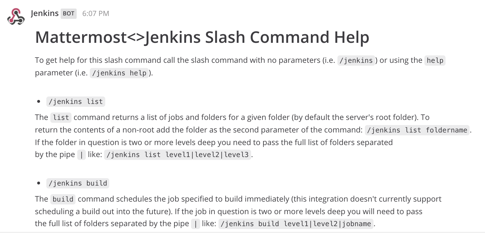

# Integrating Jenkins and Mattermost with slash commands

This repository is contains a Python Flask application that powers a slash command for 
[Mattermost](http://mattermost.com) that allows you to view and run builds on a 
[Jenkins](https://jenkins.io/) server.
 
 **Import Note**: This application is not really designed for production use. It is meant 
 only to demonstrate how to connect Mattermost and Jenkins together easily using commonly
 available tools like Python and Flash.
 
# Installing the Slash Command

In order to use this slash command on your Mattermost server you will need:

* A Mattermost server on which you have permissions to add slash commands;
* A server on which you can install and run Python code that the Mattermost server can talk to;

If you have the two things above you can proceed to the installation steps below:

## Setup the Flask Application

The following steps

1. Log into the machine that will host the Python Flask application;
2. Clone this repository to your machine: `git clone https://github.com/cvitter/mattermost-jenkins-slash.git`;
3. Copy the `config.sample` file to `config.json`;
4. Edit `config.json` to set the URL for your Jenkins server and the user name and password of the account you will use to access it;
5. Run the Flask application

**Note**: When the application is running you can test it locally by posting data to it using curl like the following example:

```
curl -X POST -F "text=build mattermost-test-1" http://127.0.0.1:5002/jenkins
```

# Using the Slash Command

Once the slash command is set up it is quite easy to use. If users have any questions simply type `/jenkins` will return command help
as shown in the screenshot below:



The slash command also takes two arguments. 

## Setup the Slash Command

# Questions, Feedback, Pull Requests Etc.

If you have any questions, feedback, suggestions, etc. please submit them via issues here: https://github.com/cvitter/mattermost-jenkins-slash/issues

If you find errors please feel to submit pull requests. Any help in improving this resource is appreciated!

# License
The content in this repository is Open Source material released under the MIT License. Please see the [LICENSE](LICENSE) file for full license details.

# Disclaimer

The code in this repository is not sponsored or supported by Mattermost, Inc.

# Authors
* Author: [Craig Vitter](https://github.com/cvitter)

# Contributors 
Please submit Issues and/or Pull Requests.