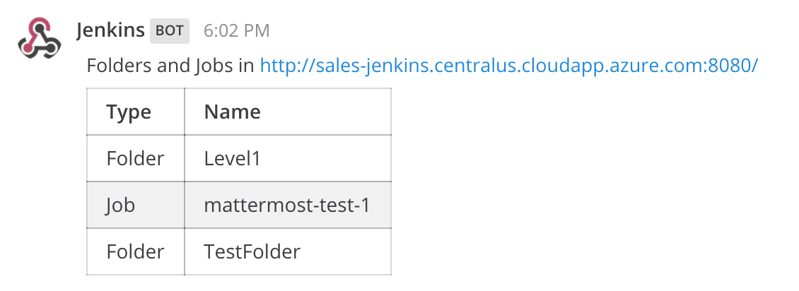
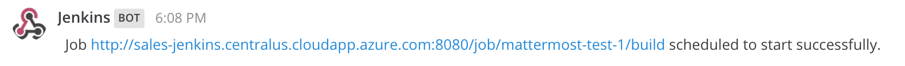

# Integrating Jenkins and Mattermost with slash commands

This repository is contains a Python Flask application that powers a slash command for 
[Mattermost](http://mattermost.com) that allows you to view and run builds on a 
[Jenkins](https://jenkins.io/) server.
 
 **Import Note**: This application is not really designed for production use. It is meant 
 only to demonstrate how to connect Mattermost and Jenkins together easily using commonly
 available tools like Python and Flash.
 
# Installing the Slash Command

In order to use this slash command on your Mattermost server you will need:

* A Mattermost server on which you have permissions to add slash commands;
* A server on which you can install and run Python code that the Mattermost server can talk to;

If you have the two things above you can proceed to the installation steps below:

## Setup the Flask Application

The following steps

1. Log into the machine that will host the Python Flask application;
2. Clone this repository to your machine: `git clone https://github.com/cvitter/mattermost-jenkins-slash.git`;
3. Copy the `config.sample` file to `config.json`;
4. Edit `config.json` to set the URL for your Jenkins server and the user name and password of the account you will use to access it;
5. Run the Flask application - there are a number of ways to run the application but I use the following command that runs the 
application headlessly and captures output into a log file for troubleshooting:

```
sudo python jenkins.py >> jenkins.log 2>&1 &
```

**Note**: When the application is running you can test it locally by posting data to it using curl like the following example:

```
curl -X POST -F "text=build mattermost-test-1" http://127.0.0.1:5002/jenkins
```

## Setup the Slash Command

Now that the Flask application is running you have to configure your slash command in Mattermost to connect to the 
application. Inside of Mattermost:

1. Click on the **Main Menu** (located in the left hand side bar next to your team and user name);
2. Select **Integrations** from the drop down menu;
3. Click on **Slash Commands**;
4. Click on **Add Slash Command**;
5. Fill in the form (refer to Mattermost help for full explanations of each field):
	1. Title - your choice (i.e. Jenkins Slash Command)
	2. Description - your choice again;
	3. Command Trigger Work - jenkins (unless you want to use something different like 'butler')
	4. Request URL - the URL of your flask application (i.e. http://something.com:5002/jenkins)
	5. Response Username - optional
	6. Response Icon - optional
	7. Autocomplete - check this so your users know that the slash command exists
	8. Autocomplete Hint - I have '[list or build] [folder or job]' in mine (you can use whatever works for you)
	9. Autocomplete Description - I have 'The Butler is at your command!' in mine
6. Click **Save** to create the slash command.
7. Test the slash command from within Mattermost and profit!

# Using the Slash Command

Once the slash command is set up it is quite easy to use. If users have any questions simply type `/jenkins` will return command help
as shown in the screenshot below:


If you want to view the list of items (jobs and folders) on your Jenkins server you can type:

```
/jenkins list
```
If you leave off the folder/job parameter like in the above example Jenkins will return the list of objects in the server's 
root like shown below:



If you want to see what is in the **Level1** folder you would type:

```
/jenkins list Level1
```

To schedule a build (to run immediately) you can type:

```
/jenkins build mattermost-test-1
```

If the job succeeds you will see the following response:

 

If the slash command fails it should return an HTTP error code as shown in the screen shot below if the 
resource can't be found on the Jenkins server.


# Questions, Feedback, Pull Requests Etc.

If you have any questions, feedback, suggestions, etc. please submit them via issues here: https://github.com/cvitter/mattermost-jenkins-slash/issues

If you find errors please feel to submit pull requests. Any help in improving this resource is appreciated!

# License
The content in this repository is Open Source material released under the MIT License. Please see the [LICENSE](LICENSE) file for full license details.

# Disclaimer

The code in this repository is not sponsored or supported by Mattermost, Inc.

# Authors
* Author: [Craig Vitter](https://github.com/cvitter)

# Contributors 
Please submit Issues and/or Pull Requests.